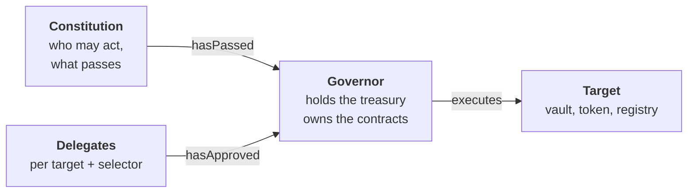
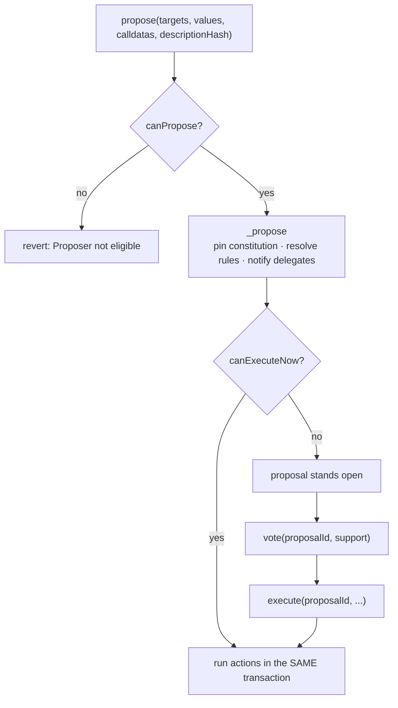
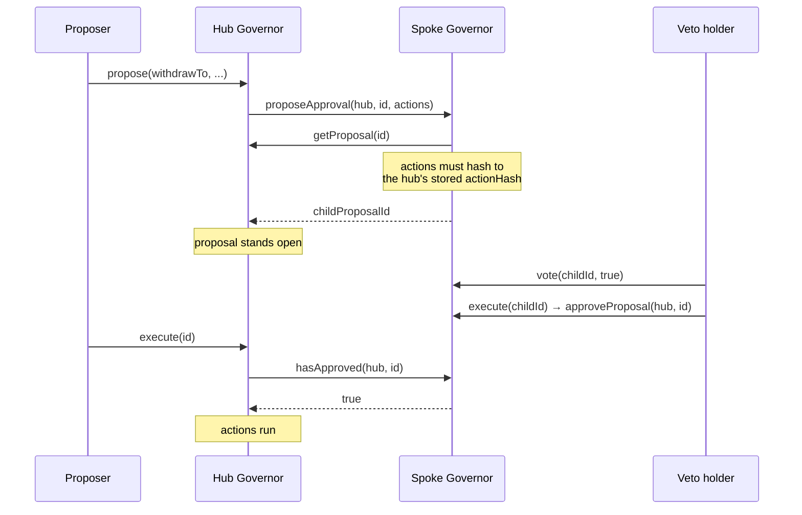
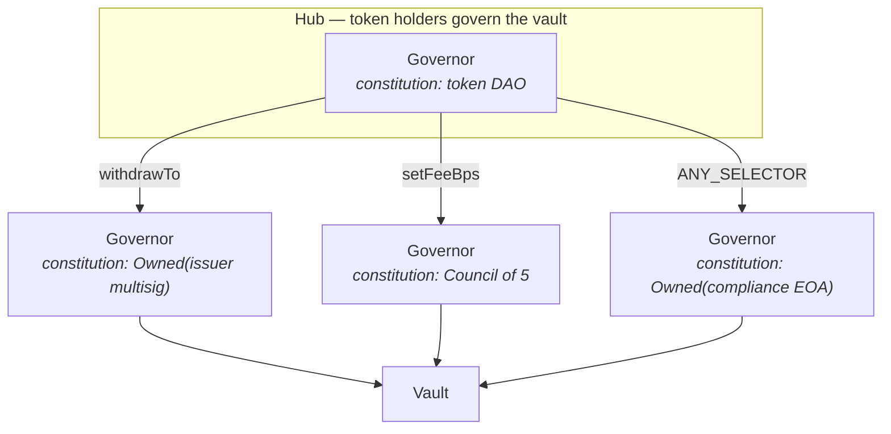
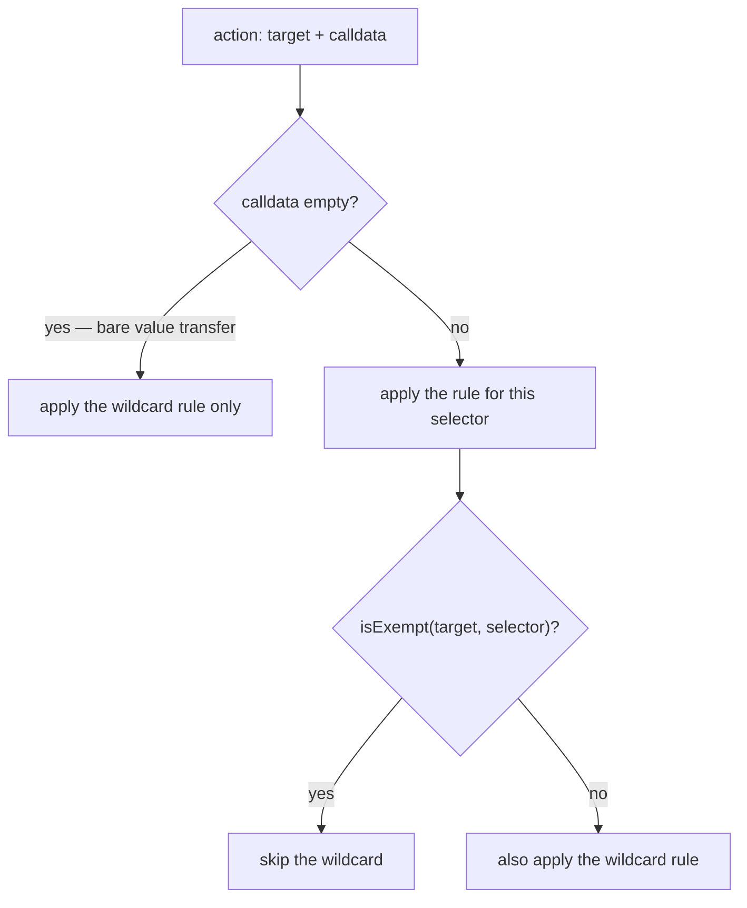
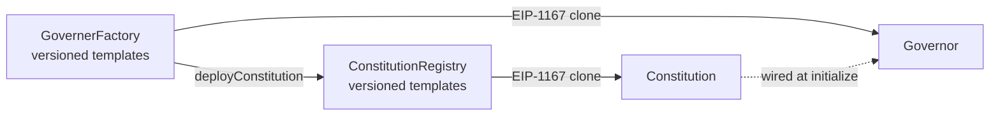
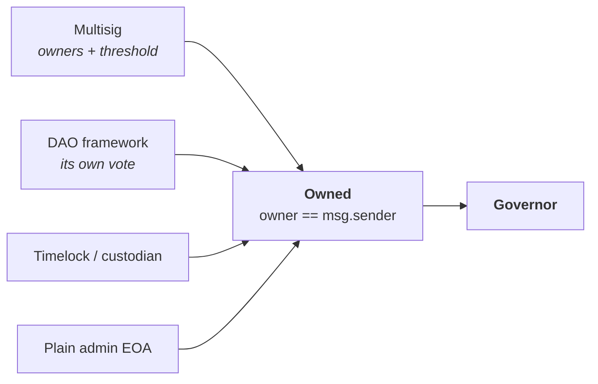

# RWA Protocol — Governance

Governance for real-world-asset vaults, built around the idea: **every proposal has to clear multiple independent gates, and one cant overrule the others.**

It lets a single `Governor` serve a solo admin, a multisig, a committee or a token DAO without changing a line.

It also lets them serve **at the same time**. A veto holder is itself a `Governor` with its own constitution, so different governance schemes can govern the same asset together — each keeping its own rules, none able to overrule another. See [Governing together](#governing-together).

---

## Contents

- [The two gates](#the-two-gates)
- [What this enables](#what-this-enables)
- [Constitutions](#constitutions)
- [Proposal lifecycle](#proposal-lifecycle)
- [Delegation and vetoes](#delegation-and-vetoes)
- [Governing together](#governing-together)
- [Rule resolution](#rule-resolution)
- [The execute gate](#the-execute-gate)
- [Deployment](#deployment)
- [External governance protocols](#external-governance-protocols)
- [Security properties](#security-properties)
- [Why ownership is two-step](#why-ownership-is-two-step)
- [Setting a Council threshold](#setting-a-council-threshold)
- [Known limitations](#known-limitations)
- [Build and test](#build-and-test)

---

## The two gates

A `Governor` holds the treasury and owns the protocol's contracts, but decides almost nothing itself. It delegates two separate judgements and requires both.



The **constitution** is the electorate: who may propose, who may vote, how much a vote weighs, and what counts as passing. Swap it and the entire governance model changes without moving a single asset — the Governor's address never changes, so every contract holding `owner == governor` is untouched.

The **delegates** are vetoes, registered per target contract *and* per function selector. They never vote. They hold a blocking approval over one specific thing the Governor can do.
The delegates are themselves Governor contracts, each with its own constitution.

A constitution that says a proposal passed cannot override a delegate that withheld approval, and an approving delegate cannot make a failed proposal pass.

---

## What this enables


**A veto that governance cannot vote away.** A trustee, transfer agent or regulator can hold a `Hard` veto over named functions. Token holders may pass whatever they like — the funds do not move without the sign-off, and nothing in the hub's own governance can revoke it.

**Authority split by function, not by contract.** Because vetoes are keyed on `(target, selector)`, the issuer can gate redemptions while a committee gates fees and a compliance officer gates everything, all on one vault. No proxy-per-role, no duplicated contracts.

**Counterparties govern through what they already run.** An institution participates using its own multisig, DAO or custody workflow. There is nothing to integrate and no framework to adopt — see [External governance protocols](#external-governance-protocols).


**Blocking power without spending power.** A veto holder can only ever refuse. An emergency key can hold a blanket veto over a vault while having no ability to move a single token out of it.

---

## Constitutions

Each implements `IConstitution`

| Constitution | Electorate | What settles a proposal | Executes early |
|---|---|---|---|
| `Council` | Named members, one vote each | Votes for ≥ threshold of the membership **as it stood at proposal time**, via checkpoints | no |
| `Owned` | A single address — an EOA, a multisig, another DAO, or another Governor | The owner **proposed** it. With one voter there is nobody else to hear from, so filing is deciding | yes |

The interface:

```solidity
interface IConstitution {
    function name() external view returns (string memory);
    function canPropose(address proposer) external view returns (bool);
    function canVote(address voter) external view returns (bool);
    function getVotingPower(address voter) external view returns (uint256);
    function getVotes(address governor, uint256 proposal, address voter) external view returns (uint256);
    function getDefaultVotingParameters() external view returns (VotingParameters memory);
    function hasPassed(address governor, uint256 proposal) external view returns (bool);
    function canExecuteEarly(address governor, uint256 proposal) external view returns (bool);
    function executionGrace() external view returns (uint256);
}
```

> **Not listed: `RWAHolder`.** A token-weighted constitution exists in the tree as a **draft scaffold only** — it is not finished, not audited, and not deployable. Voting power is read straight off current balance with no snapshot, so the same tokens can vote from two addresses in the same proposal. Finishing it means putting `RWA.sol` on `ERC20Votes` and reading `getPastVotes` here. Until then, treat it as unimplemented.

**`canExecuteEarly`** is what collapses the lifecycle for small electorates. A council votes over a period by design, so the deadline is the point. An owner has nobody left to hear from, so waiting is pure latency.


---

## Proposal lifecycle



`propose` creates the proposal, then asks whether it is already settled. Where it is — an owner filing under `Owned`, since there is no second voter to wait for — the actions run in that same transaction. **An owned Governor therefore behaves like `Ownable` from a single call, with a full proposal trail behind it.**

Where it isn't settled the proposal simply stands open. It is never reverted: rolling back would also roll back the `proposeApproval` calls that notify delegates, so a veto holder would never learn the proposal exists.

**No ballot is ever cast on the proposer's behalf.** Proposing and supporting stay separate acts — conflating them would start every council proposal one vote up. An owned proposal executes with `forVotes == 0`, because `Owned.hasPassed` reads *who proposed it*, not a tally.

### Identity

```solidity
actionHash = keccak256(abi.encode(targets, values, calldatas, descriptionHash))
proposalId = uint256(keccak256(abi.encode(address(this), block.chainid, actionHash, nounce)))
```

Actions are never stored — only `actionHash`. `execute` takes them back as arguments and re-hashes, so a proposal is permanently bound to the exact calls it was created with.

---

## Delegation and vetoes

Delegation is registered as `delagateGovernance[target][selector]`. **A delegate is always another `Governor`** — that is the only thing implementing `IGoverner`, so no adapter contract exists or is needed. A veto holder is a Governor whose own constitution names them.



During `propose`, every matching delegate is called with the full action list and recorded against the proposal. It cannot possibly have approved yet — it was notified in that same transaction — which is why **a delegated action is always at least two transactions.**

The spoke re-hashes the actions it was shown and checks them against the hub's stored `actionHash`, so a veto holder can only ever be asked to approve what the hub genuinely proposed.

### Soft and hard

Both levels are real vetoes — the delegate must approve either way. What differs is who owns the registration.

| | `Soft` | `Hard` |
|---|---|---|
| Must approve before execution | yes | yes |
| Who can move or drop the registration | the hub, by proposal | **only the holder** |
| Governance can overrule it | in two steps — revoke, then re-propose | no |

`Soft` is the zero value, so an omitted `authority` yields an *enforced but revocable* veto — the safe default. A `Hard` veto is a permanent, unrecoverable commitment: if its holder disappears, that target+selector is frozen forever. Right for a regulator or trustee; wrong for almost everything else.

The hub's lockout on `Hard` is the mechanism, not an oversight. A hub able to reassign a live veto would reassign it to a puppet.

### Governing together

A veto holder is a `Governor` with a constitution of its own, so **the parties gating one action need not share a governance model.** Each keeps its own rules, its own electorate and its own clock; the hub only ever asks `hasApproved`.



Reading that: the token holders decide *what* the vault does, but moving funds also needs the issuer's multisig, changing fees also needs a five-member committee, and **everything** also needs the compliance officer. Four schemes — a token DAO, a multisig, a committee and a single key — cooperating on one contract, with no shared framework and no common quorum.

This works because the interface between them is deliberately thin. A delegate is asked one question and answers one bit. It never learns how the hub reached its decision, and the hub never learns how the delegate reached its own — a council spoke runs a five-day vote, a multisig spoke clears a threshold, an owned spoke settles the moment its owner files, and to the hub all three are `hasApproved` returning true.

The composition is also **asymmetric on purpose**. Each spoke gates only the selectors it was registered for, so authority is scoped rather than shared: the compliance officer holds a blanket veto but cannot spend, the issuer can block withdrawals but has no say on fees, and the token holders can act alone on anything nobody gated.

### Deadline stretching

A spoke resolves on its own constitution's clock, which may run past the hub's. `_propose` reads each delegate's deadline and stretches `voteEnd` to cover the slowest, so a proposal can never expire while it is still legitimately waiting on a veto holder.

---

## Rule resolution

Rules are keyed on `(target, selector)`. `ANY_SELECTOR` (`0xffffffff`) is a wildcard meaning *any call to this target*.



A wildcard and a specific rule both apply: **delegates union, voting parameters take the maximum.** A narrower rule can raise the bar but never undercut a blanket one.

**Bare value transfers are covered.** `{to, value, ""}` carries no selector, but it still reaches the target's `receive`/`fallback`, so the wildcard applies. Otherwise a plain transfer would walk past the veto that `to.withdraw()` is subject to, for the same money and the same destination.

### Exemptions

The `delegate` field carries three meanings:

| value | meaning |
|---|---|
| `address(0)` | no delegate — the slot is ungated and the hub owns it |
| `address(this)` | **exempt** — this selector is carved out of the target's wildcard |
| anything else | a veto holder, `Soft` or `Hard` per the authority flag |

The sentinel lives in the same mapping as every other rule, so a veto holder auditing their target sees carve-outs in the same place they see vetoes.

**Carving out of a `Hard` blanket veto requires that holder's consent.** The wildcard lives at a different key, so without this the hub could write an exemption onto one selector and walk out of a veto it is not allowed to revoke. The gate is on the exemption specifically — adding another veto only tightens, and dropping a third party's soft veto leaves the blanket untouched.

---

## The execute gate

These run in order, and the order is load-bearing.

| # | Check | Why | Revert |
|---|---|---|---|
| 1 | proposal exists, nonce matches | guards a stale or fabricated id | `no such proposal` |
| 2 | not already executed | set before outbound calls, so a target cannot re-enter | `Proposal already executed` |
| 3 | constitution unchanged | an outgoing electorate cannot bank a passed proposal and fire it after governance moves on | `constitution changed` |
| 4 | inside the grace window | 30 days past `voteEnd`; an abandoned proposal lapses rather than standing forever | `proposal expired` |
| 5 | actions match | re-hashed against the stored `actionHash` | `actions do not match proposal` |
| 6 | voting closed, or the constitution waives it | an owner has nobody left to hear from | `Voting still open` |
| 7 | **every delegate has approved** | the veto — checked independently of the vote, and applies to an owner exactly as to a council | `delegate approval missing` |
| 8 | the constitution says it passed | the only check the electorate controls | `Proposal did not pass` |

`canExecuteNow(proposalId)` is the same predicate in answering form. `propose` uses it to decide whether to run inline; clients use it to decide whether an action needs one transaction or two.

---

## Deployment



Both registries are owner-gated for *registration* and open for *deployment*. `deployGovernance` stands up a constitution and its governor atomically, so neither can be left pointing at one that doesn't exist. Deprecating a version blocks new clones only; existing ones keep running, since a clone's implementation address is baked into its bytecode.

Initializers take their authority as a **parameter**, never `msg.sender` — the registry is the caller.

**The governor's own selectors can be seeded at deployment.** A governor's address is deterministic, so it can be wired to gate its own `changeConstitutionalStrategy` in the very transaction that creates it. Without that, the most powerful action in the system is ungated in the window before the first proposal lands.

---

## External governance protocols

There is no integration layer here, for any external system — no interfaces, no adapters, no signature verification. This is the whole of it:

**Anything that can make a call can govern.** `Owned` names an address as the owner and checks `msg.sender` against it. Whether that address is an EOA, a multisig, a DAO framework, a timelock, a custodian's controller, or another `Governor` is invisible and irrelevant.



The external system settles its own consent however it likes, *before* it calls — a multisig reaching threshold, a DAO passing a vote, a custodian clearing its approval workflow. None of that needs re-expressing here, and re-expressing it would only be a second, weaker copy of a mechanism that already ran.

*Worked example.* A Gnosis Safe is put in charge by deploying `Owned` with the Safe's address as owner. Owners confirm one Safe transaction calling `propose`; `msg.sender` is the Safe; the constitution says that settles it; the action runs. Three of five owners agreeing was decided inside the Safe, and the Governor neither sees nor needs to know it.

**Holding a veto.** The external system owns an `Owned` constitution on a spoke Governor. Approval is a vote then an execute — two calls, but anything able to batch does both in one (a Safe through MultiSend, a DAO whose proposals are already multicalls), and the second call is permissionless regardless.

**Gasless EOA flows** go through the ERC-2771 forwarder. Contract accounts do not need it: they act by executing transactions, which is what they already do.

## Security properties

- **Actions are bound.** Never stored, only hashed. `execute` re-hashes what it is given.
- **Proposals are pinned to their rules.** A proposal records the constitution in force when it was created and refuses to execute under a different one.
- **Re-entrancy.** OZ `ReentrancyGuard` on `propose`, `execute` and `proposeApproval` — the three entry points that hand control to arbitrary addresses. The proposal counter is consumed *before* any external call, so a re-entrant proposal cannot collide with the one being built.
- **Execution is atomic.** A failing action takes the whole proposal down; nothing is half-applied. Revert reasons and custom errors bubble up unchanged.
- **Vetoes bind owners too.** An owned governor cannot fast-path past a delegated selector.
- **Approvals are one-way and idempotent.** Approving twice never rewrites the original decision timestamp.


---


### Setting a Council threshold

Thresholds and quorums are basis points of the electorate, **ceiling-rounded**:

```solidity
required = (bps * members + 9999) / 10000
```

So a bps is not the fraction you would say out loud. To require **M of N**, use:

```
bps = floor(M * 10000 / N)
```

The rounding makes the naive value wrong in the dangerous direction — it rounds *up*, silently demanding more agreement than intended:

| bps | N=3 | N=4 | N=6 | N=9 |
|---|---|---|---|---|
| `5000` | 2 | 2 | 3 | 5 |
| `6666` | **2** | 3 | 4 | 6 |
| `6667` | **3** | 3 | 5 | 7 |
| `10000` | 3 | 4 | 6 | 9 |

`6667` is the intuitive way to write "two thirds" and it is **unanimity on a three-member council** — one basis point away from `6666`, which is the 2-of-3 you meant. A council that set it would find every proposal needing all three members, and would likely read that as a bug elsewhere.

Two consequences worth planning around:

- **A bps encodes a ratio, not a count.** The required number of votes moves when the roster does. `Council` checkpoints membership at proposal creation, so an open proposal keeps the bar it was created with — but adding a member changes what the same bps means for every *later* proposal.
- **It compounds with wildcard rules.** A wildcard and a specific rule take the maximum, so a blanket `6667` quietly raises every selector on that target to unanimity on a three-member council, whatever the narrower rules say.

`Owned` is unaffected: any bps of a one-address electorate ceiling-rounds to one vote.

---

## Known limitations

- **A selector-specific veto is escapable.** Vetoes are keyed on `(target, selector)`, so one on `withdrawTo` leaves `transferOwnership` open — governance can move the asset to an ungated governor and withdraw from there. **Only a wildcard veto is actually hard.** Register hard vetoes on `ANY_SELECTOR`. Must be initialized safely with wildcard registration if required.
- **Installing a veto is not retroactive.** `delegates[proposalId]` is snapshotted at proposal time, so proposals already in flight are unaffected. Audit open proposals when adding one.
- **A `Hard` veto whose holder disappears freezes that slot permanently.** That is the point of `Hard`, but it means handing one out is irreversible.

---

## Build and test

```shell
forge build
forge test
forge coverage --ir-minimum
```

252 tests across 24 suites. If a suite ever disappears from a run, `forge clean` — Foundry's incremental cache can silently skip one.

### Layout

```
src/governance/
├── Governer.sol                     # proposals, voting, execution, delegation
├── GovernerFactory.sol              # versioned Governor templates + deployment
├── interface/
│   ├── IGoverner.sol                # Proposal, VotingParameters
│   └── IGovernerFactory.sol
└── constitution/
    ├── ConstitutionRegistry.sol     # versioned constitution templates
    ├── RWAHolder/RWAHolder.sol      # token-weighted — DRAFT SCAFFOLD, not implemented
    ├── council/council.sol          # committee, checkpointed membership
    ├── owned/owned.sol              # single address
    └── interface/
        ├── IConstitution.sol
        └── IConstitutionRegistry.sol
```
